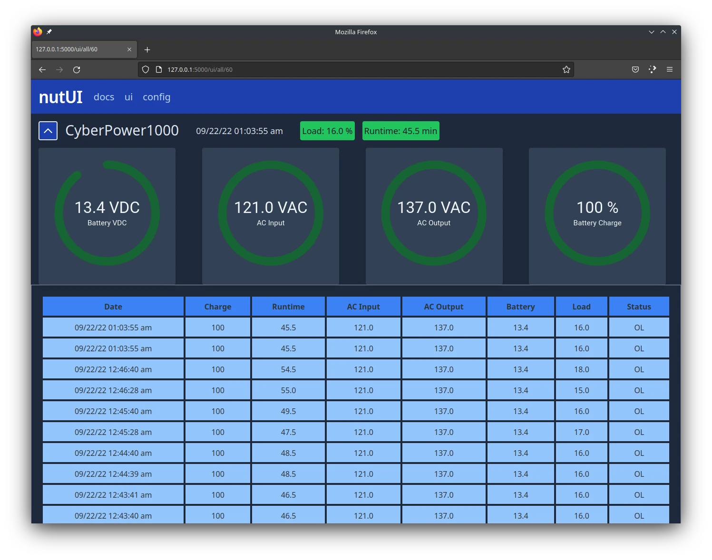

# nutUI - Flask WebUI for nut-server

## Testing Build - Not considered production ready
<p align="center">

</p>
<p align="center">
nutUI Main Page with Light Theme
</p>

<p align="center">

</p>
<p align="center">
nutUI Main Page with Dark Theme
</p>


```
git clone https://github.com/beardedtek-com/nutui.git
```

```
nutui.py -h
usage: nutui.py [-h] [-c] [-f] [-v] [-u] [-a] [-n NUTHOST] [-ah APIHOST] [-ap APIPORT] [-i INTERVAL] [-l NUTLOGIN] [-p NUTPASSWORD]

Starts nutclient and nutui flask server

options:
  -h, --help            show this help message and exit
  -c, --clientonly      Runs nutclient only. Disables the flask server
  -f, --flaskonly       Runs the flask server only
  -v, --verbose         Verbose Output
  -u, --uwsgi           Launches web app with uwsgi instead of flask development server
  -a, --all
  -n NUTHOST, --nuthost NUTHOST
                        ip/hostname of nut server (defaults to 127.0.0.1)
  -ah APIHOST, --apihost APIHOST
                        ip/hostname of nutUI api server
  -ap APIPORT, --apiport APIPORT
                        port number of nutUI api server
  -i INTERVAL, --interval INTERVAL
                        number of seconds between polling nut-server
  -l NUTLOGIN, --nutlogin NUTLOGIN
                        nut-server login (default: None)
  -p NUTPASSWORD, --nutpassword NUTPASSWORD
                        nut-server login (default: None)
```